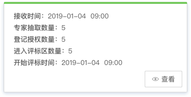
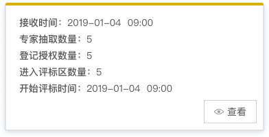
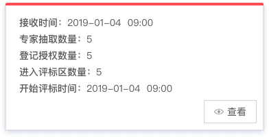
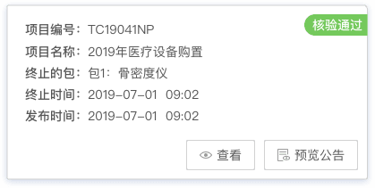
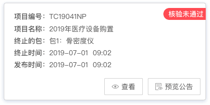

## Card 卡片

将信息聚合在卡片容器中展示，保持界面井然有序，且非常简约。包含标题、内容、操作等。

**应用场景**：常用于后台概览页面，把信息聚合化。  
**交互方式**：卡片主要供查看，点击操作按钮进行信息处理，可以自动适应Web页面尺寸。

### 类型一

应用场景：展示任务当前状态。(如：正常、警告、报警 ）  
交互方式：卡片顶部用颜色区分任务状态，点击操作按钮进行信息处理。

<el-row :gutter="20">
  <el-col :span="8">
   
  </el-col>
  <el-col :span="8">
   
  </el-col>
  <el-col :span="8">
   
  </el-col>
</el-row>

### 类型二

应用场景：展示任务当前情况。  
交互方式：卡片右上方添加角标，用颜色区分项目状态，点击操作按钮进行信息处理。

<el-row :gutter="20">
  <el-col :span="10">
   
  </el-col>
  <el-col :span="10">
   
  </el-col>
</el-row>