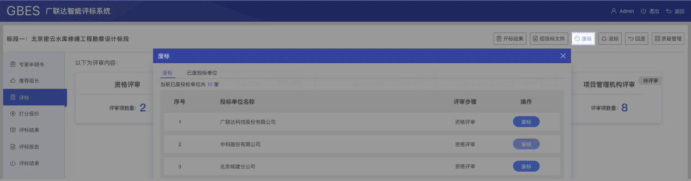

## CopyWriting 文案

清晰准确的传达功能信息。

### 精简语句

省略无用词汇，不重复用户已知事实；在绝大多数交互场景下，都无需界面描述出全部的细节。尽量提供简短、易于快速获取的内容。 例如：新建项目的【保存】功能的描述，直接描述为【保存】即可，而不是【保存新建项目】

### 表述一致

描述同一个事物的词汇要保持统一；  
上下文的语法、语种、语序要保持统一；  
操作的名称和目标页面标题的名称保持一致。

### 友好、尊重用户

多给用户支持与鼓励，不要命令和强迫用户。  
如果你想留住你的用户，当出错的时候就不要责怪用户。  
专注于解决问题，而不是指责。例如：用户输入的密码有误提示。

### 拉近距离

直接使用你、我来和用户对话，与用户建立亲密感。避免使用您，让用户感觉太过疏远。

### 数据真实性

原型和效果图内容使用真实信息，禁止胡乱编造。

