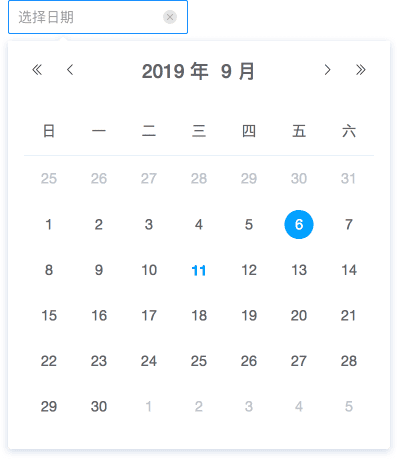
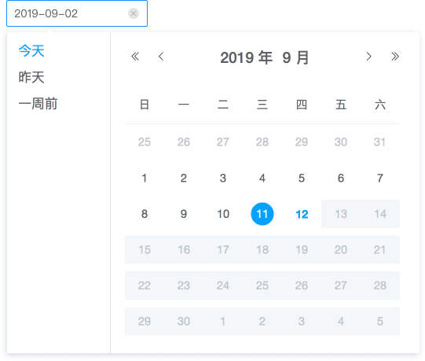
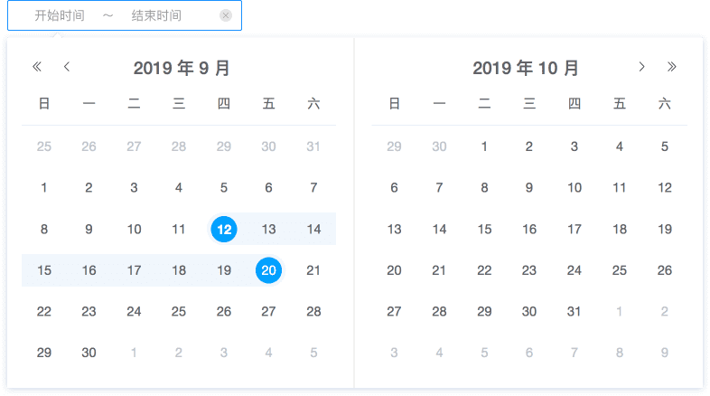
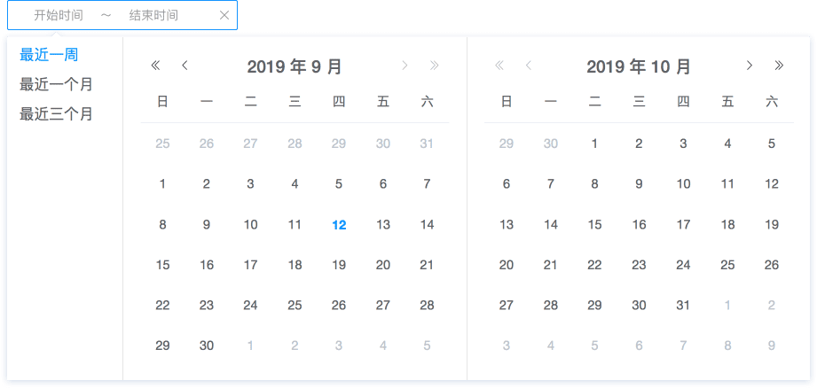
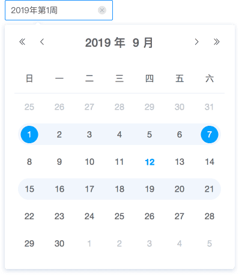
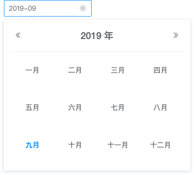
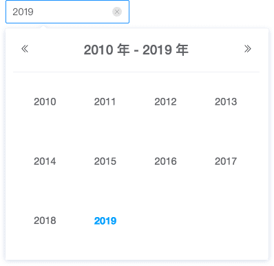
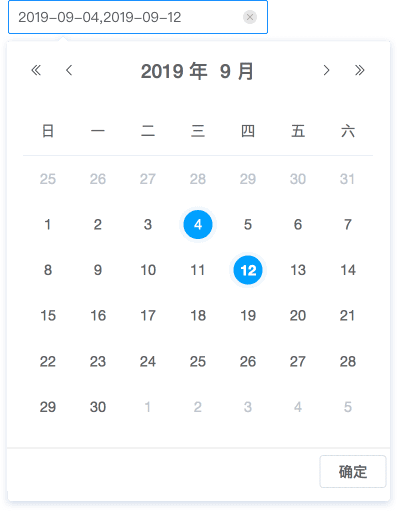

## DatePicker 日期选择器

用于选择或输入日期。

**应用场景**：用于界面中需要选择具体日期或者日期区间。  
**交互方式**：点击输入框显示日历面板，可选择单个日期或日期区间。

### 类型一

用于具体时间选择，只能选择一个日期。

<el-row :gutter="20">
  <el-col :span="8">
  默认状态
   
  </el-col>
  <el-col :span="8">
  悬浮状态
   
  </el-col>
  <el-col :span="8">
  图标悬浮状态
   
  </el-col>
</el-row>

<el-row :gutter="20">
  <el-col :span="8">
  查询后状态
   
  </el-col>
  <el-col :span="8">
  查询后悬浮状态
   
  </el-col>
  <el-col :span="8">
  </el-col>
</el-row>

<el-row :gutter="20">
  <el-col :span="24">
  查询状态
   
  </el-col>
  </el-col>
</el-row>
<el-row :gutter="20">
  <el-col :span="24">
  查询状态(带快捷选项)
   
  </el-col>
</el-row>

### 类型二

用于时间区间选择，可以选择一组连续的日期。

<el-row :gutter="20">
  <el-col :span="12">
  默认状态
   
  </el-col>
  <el-col :span="12">
  悬浮状态
   
  </el-col>
</el-row>
<el-row :gutter="20">
  <el-col :span="12">
  查询后状态
   
  </el-col>
  <el-col :span="12">
  查询后悬浮状态
   
  </el-col>
</el-row>

<el-row :gutter="20">
  <el-col :span="24">
  查询状态
   
  </el-col>
  </el-col>
</el-row>
<el-row :gutter="20">
  <el-col :span="24">
  查询状态(带快捷选项)
   
  </el-col>
</el-row>

### 类型三

通过扩展基础的日期选择，可以选择周、月年或多个日期。

<el-row :gutter="20">
  <el-col :span="12">
  选择周
   
  </el-col>
  <el-col :span="12">
  选择月
   
  </el-col>
</el-row>

<el-row :gutter="20">
  <el-col :span="12">
  选择年
   
  </el-col>
  <el-col :span="12">
  选择多个日期
   
  </el-col>
</el-row>