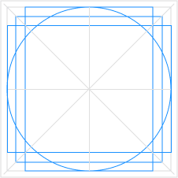
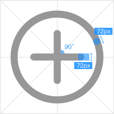
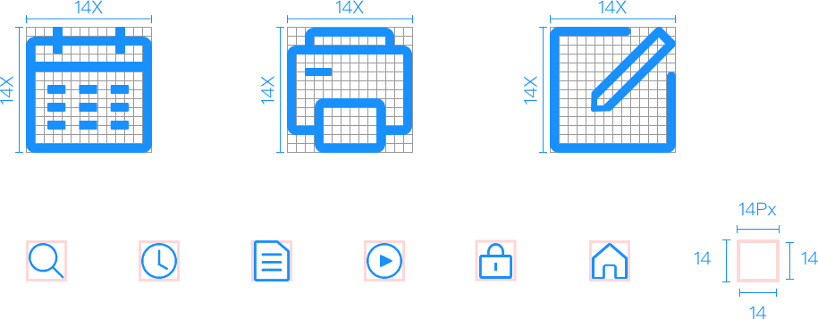

## Icon 图标

图标是具有指代意义的图形，也是一种标识。通过使用图标表达命令，强调状态，表示产品或类别。   
为了系统及跨平台之间图形认知保持一致， 政务产品的图标在设计和使用时有以下两个原则：

### 基本原则

* 简单的图形语言以及高辨识度，清晰、直观的图标更能明确指代含义便于识别记忆； 
* 图形简洁扁平，图形设计选用最简单的表现方式，避免复杂的图形； 
* 保持图标之间一致的风格和表现方式，界面中的所有图标都应该在透视和笔画权重等细节设计上保持一致。

#### 轮廓线
根据不同的图标形状类型使用不同的轮廓线，可以使图标之间保持一致的视觉效果。 图标在1024 * 1024(16 * 16的64倍)的画板中制作。  

#### 笔画
一致的笔画权重是保持整个图标系统视觉统一的关键， 图标设计中，线条统一为 72px 宽度，外轮廓线统一半径为 72px 的圆角， icon 内部空间的边角保持直角，笔画的终端为圆角。  

#### 标准图标系统
界面中图标尺寸大多为14px*14px，粗细为1px，圆角为2px。(可根据实际运用场景等比缩放)  

### 图标集合

<ul class="icon-list">
  <li v-for="name in $icon" :key="name">
    
      <i :class="'el-icon-' + name"></i>
      {{'el-icon-' + name}}
    
  </li>
</ul>
