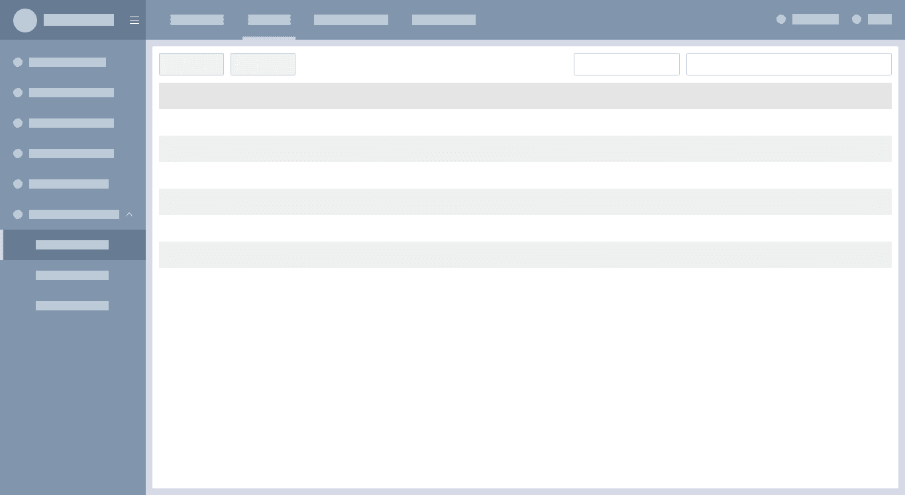
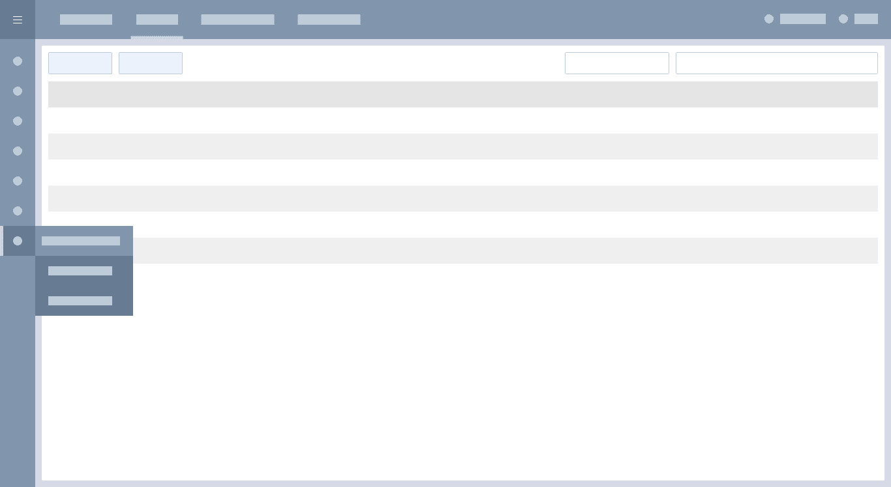
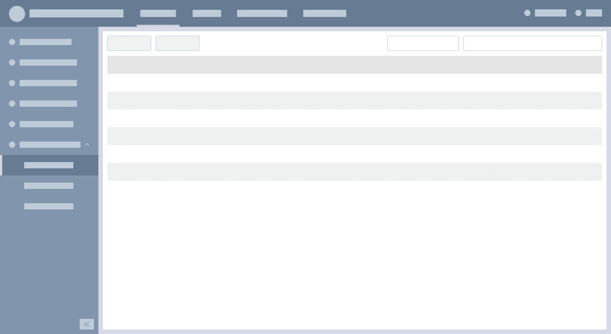
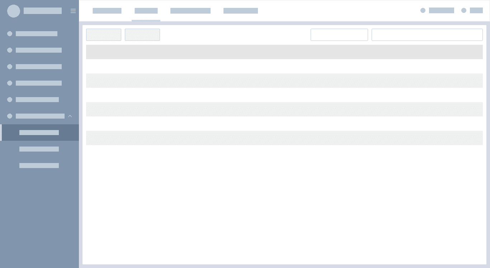
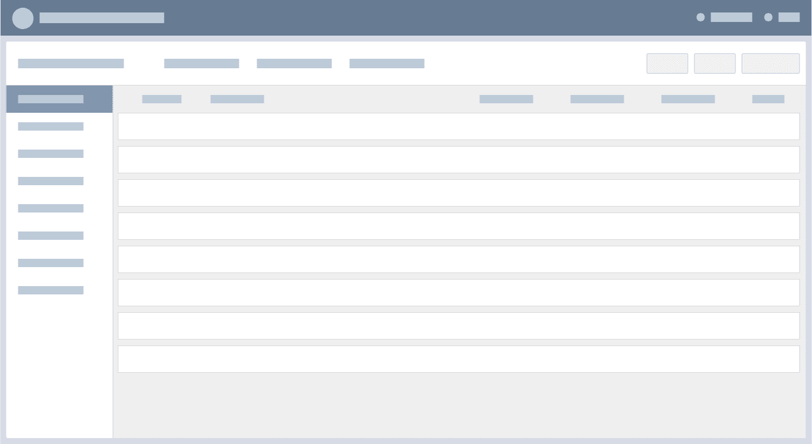

## Layout 布局

### 顶部-侧边布局（默认布局）

主导航放置于页面的顶端，高度为60px。从左到右依次为：Logo、产品名称、展开/收起图标、一级导航项、辅助菜单（用户、修改密码、通知等）。 二级导航放置于页面的左侧，宽度可根据实际字段长度调整，建议180px～240px。

页面横向空间有限时，侧边导航可收起。

### 顶部通栏-侧边布局（用于logo文字较多的情况）

顶部导航通栏展现，侧导航可收起。展开/收起控件位于底部。

### 左右布局 
层左侧导航通栏展现，侧导航可收起。

### 上下布局
左侧导航通栏展现，侧导航可收起。

