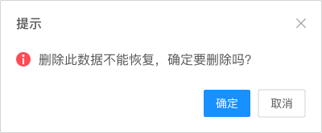
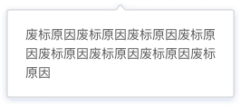

## Message 消息提示

分隔内容上有关联但属于不同类别的数据集合。

**应用场景**：页面内容需要给用户进行反馈、提示或确认时使用。  
**交互方式**：分为自动浮现、鼠标悬浮和点击弹出。

### 类型一

应用场景：常用于主动操作后的反馈提示，从顶部出现，3 秒后自动消失。用来显示【成功、警告、消息、错误】等操作反馈，也可以添加关闭按钮，手动关闭提示信息。  
交互方式：用户操作成功后，页面顶部居中显示，3秒后向上滑动收起，支持画布区、对话框内显示。从左到右依次为：成功提示、警告提示、错误提示、默认提示。

<el-row :gutter="20">
 <el-col :span="6">
   
  </el-col>
  <el-col :span="6">
   
  </el-col>
  <el-col :span="6">
   
  </el-col>
  <el-col :span="6">
   
  </el-col>
</el-row>

### 类型二

应用场景：模拟系统的消息提示框而实现的一套模态对话框组件，用于消息提示、确认消息和提交内容。  
交互方式：只能点击关闭按钮或取消按钮来关闭对话框。

<el-row :gutter="20">
 <el-col :span="8">
   
  </el-col>
  <el-col :span="8">
   
  </el-col>
  <el-col :span="8">
   
  </el-col>
</el-row>

### 类型三

应用场景：用于功能按钮的引导与提示。  
交互方式：分为点击提示、滑过提示。

### 类型四

应用场景：常用于文字信息/图标提示。  
交互方式：展示鼠标 hover 时的提示信息。

### 类型五

应用场景：加载数据时显示动效，数据量大或网速慢时出现加载过程提示。  
交互方式1：局部加载，在页面中心提示，无遮罩。加载按钮不断旋转，告知用户在加载过程中。

交互方式2：全局加载，在页面中心提示，有遮罩。加载动效覆盖住整个页面。（可自定义加载图标和遮罩颜色）

