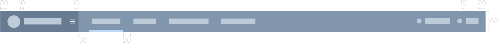
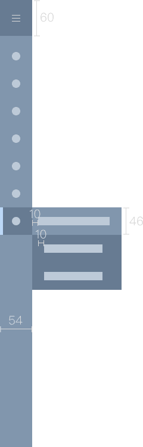

## NavMenu 导航菜单

一般分为顶部导航和侧边导航，顶部导航提供全局性的类目和功能，侧边导航提供多级结构来收纳和排列网站架构。

### 顶部导航

导航高度60px，文字16px。 
导航选中时，下方蓝条高度5px，宽度为文字宽度+16px。

### 侧边导航

左侧导航栏分为三种： 

1. 【默认展开】 导航宽度220px(180px～240px)，选中高度46px，默认文字14px。 

2. 【收起状态】 收起宽度54px，右侧展开区域宽度150px。 

3. 【项目驱动页导航】 导航宽度220px，标题高度46px，文字16px；选中模块高度32px，默认文字14px；提示红点6px。

<el-row :gutter="20">
  <el-col :span="8">
  【默认展开】
  
  </el-col>
  <el-col :span="8">
  【收起状态】</el-col>
  <el-col :span="8">【项目驱动页导航】</el-col>
</el-row>