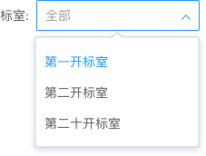
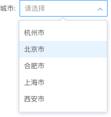
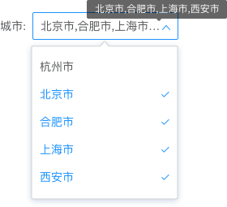
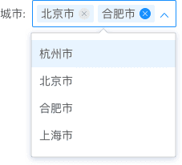
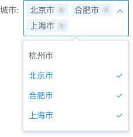
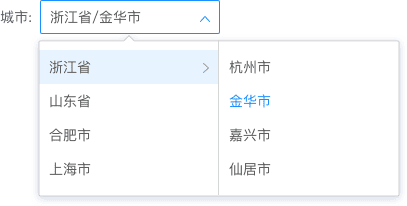

## Select 下拉框

允许用户从列表中选择一个或多个选项，为用户在选项的数量上提供了更多的灵活性。

**应用场景**：适用于输入框内的备选项较多的情况下使用。  
**交互方式**：鼠标悬浮在下拉框上高亮显示，点击后出现下拉框。

### 类型一
下拉单选：下拉单选列表用于从一组互斥值列表中选择。用户仅能选择一个选项。

<el-row :gutter="20">
  <el-col :span="12">
  默认状态
   
  </el-col>
   <el-col :span="12">
   悬浮状态
   
  </el-col>
</el-row>

<el-row :gutter="20">
  <el-col :span="12">
  下拉-悬浮状态
   
  </el-col>
   <el-col :span="12">
   下拉-选中状态
   
  </el-col>
</el-row>

### 类型二

下拉多选1：用于选择多个值，且内容修改频率较低时。当数值较多时显示省略号，鼠标悬浮时显示全部信息。

<el-row :gutter="20">
  <el-col :span="12">
  默认状态
   
  </el-col>
   <el-col :span="12">
   悬浮状态
   
  </el-col>
</el-row>

<el-row :gutter="20">
  <el-col :span="12">
  下拉-悬浮状态
   
  </el-col>
   <el-col :span="12">
   下拉-选中状态
   
  </el-col>
</el-row>

下拉多选2：用于内容修改频率较高时，可直接在下拉框内删除信息。当数值较多时，下拉框自动撑高。

<el-row :gutter="20">
  <el-col :span="12">
  默认状态
   
  </el-col>
   <el-col :span="12">
   悬浮状态
   
  </el-col>
</el-row>

<el-row :gutter="20">
  <el-col :span="12">
  下拉-悬浮状态
   
  </el-col>
   <el-col :span="12">
   下拉-选中状态
   
  </el-col>
</el-row>

### 类型三

级联单选：用于联动信息的选择，层级由大到小展现，需选择末级节点一个值，选择框内展示所有层级路径。

<el-row :gutter="20">
  <el-col :span="12">
  默认状态
   
  </el-col>
   <el-col :span="12">
   悬浮状态
   
  </el-col>
</el-row>

<el-row :gutter="20">
  <el-col :span="12">
  下拉-悬浮状态
   
  </el-col>
   <el-col :span="12">
   下拉-选中状态
   
  </el-col>
</el-row>