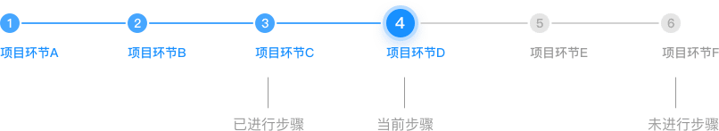
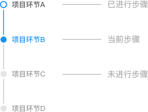

## Steps 步骤条

引导用户按照流程完成任务的分步导航条，可根据实际应用场景设定步骤，步骤不得少于 2 步。

**应用场景**：需要通过将任务分解成一系列步骤的形式简化时，请使用步骤条。  
**交互方式**：高亮当前步骤，未进行的步骤置灰。

### 类型一

基础步骤条：每个步骤有其对应的步骤状态描述，文字可折行显示。用于步骤文字描述较多的情况。

### 类型二

指示步骤条：常用于导航，适合步骤文字描述较少的情况。

### 类型三

垂直步骤条：常用于时间维度的步骤，可根据实际场景添加时间。

