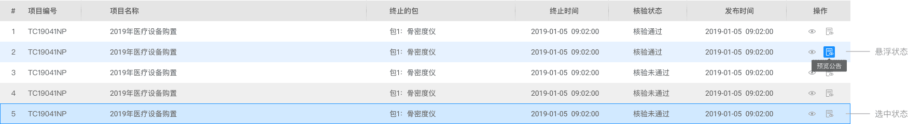
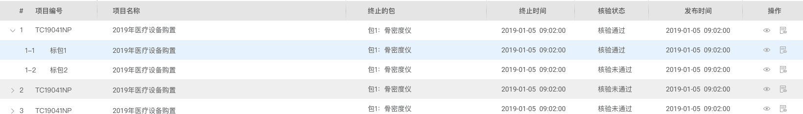
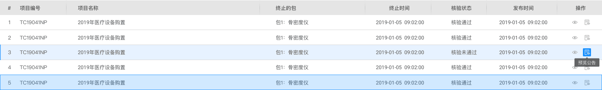
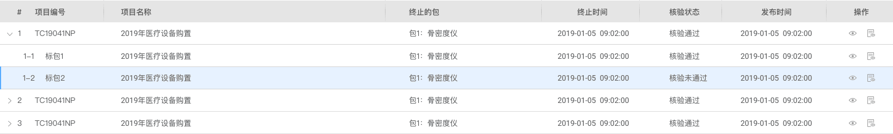
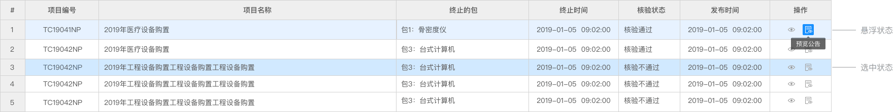
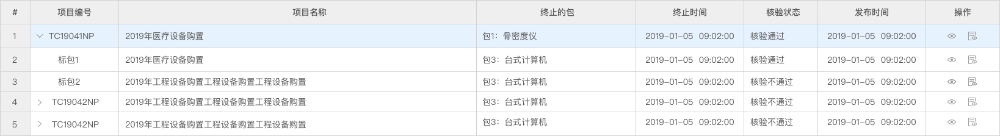
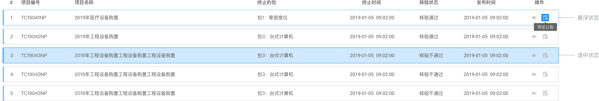
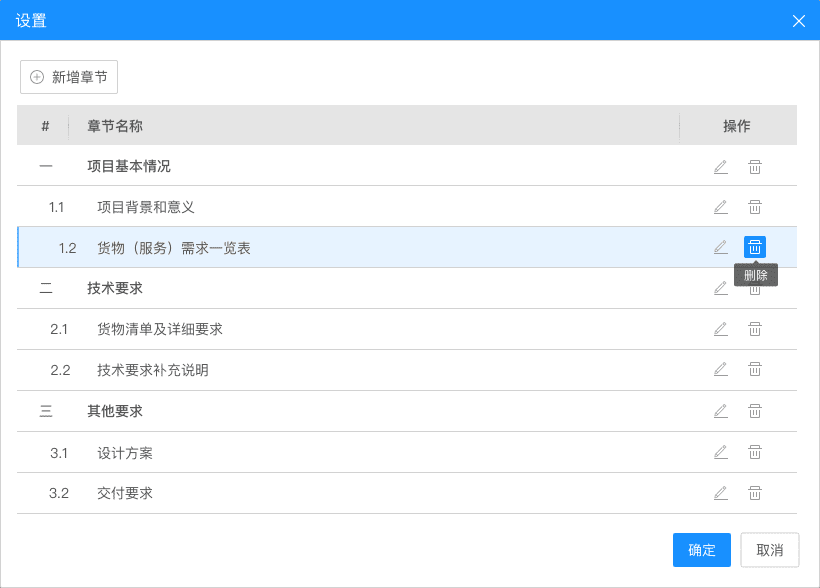

## Table 表格

用于展示多条结构类似的数据，可对数据进行排序、筛选、对比或其他自定义操作。

**应用场景**：用于默认列表或者数据较多时，可以改变宽度，表格内容根据业务开放行内编辑功能。  
**交互方式**：鼠标悬浮和点击时，改变该行的显示状态。

### 类型一

斑马线表格。可以更容易区分出不同行的数据。

斑马线表格-表格树结构

### 类型二

简约表格。 

简约表格-表格树结构

### 类型三

传统表格。 

传统表格-表格树结构

### 类型四

卡片式表格。 

卡片式表格-表格树结构

### 类型五

弹窗内表格。遵循弹窗设计规范，弹窗内表格样式可根据业务需求变换。

