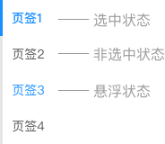

## Tabs 标签页
分隔内容上有关联但属于不同类别的数据集合。

**应用场景**：提供平级的区域将大块内容进行收纳和展现，保持界面整洁。  
**交互方式**：点击页签进入对应的模块内容。

### 类型一

基础标签：基础的、简洁的标签页。

### 类型二

卡片式标签：选项卡样式的标签页。

### 类型三

增减标签页按钮：只能在选项卡样式的标签页下使用。 

### 类型四

纵向标签：用于界面上对内容进行锚点定位。 

