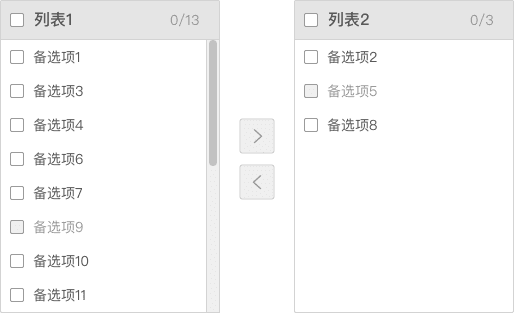
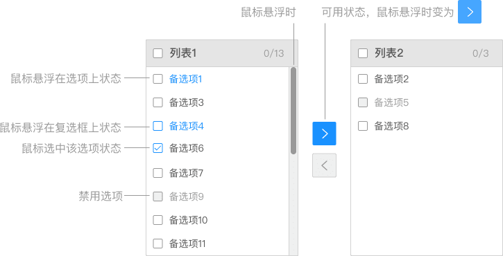
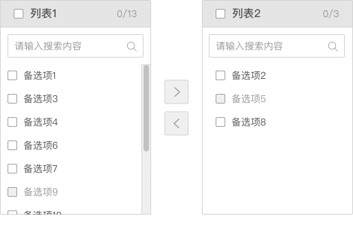
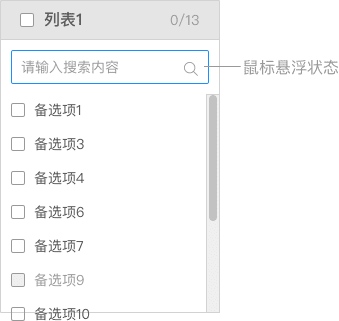
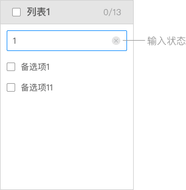
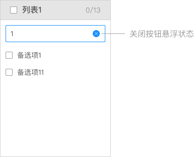
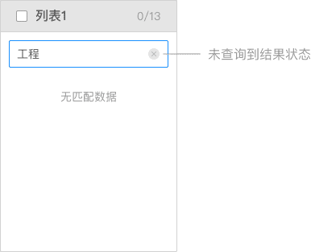

## Transfer 穿梭框

穿梭选择框用直观的方式在两栏中移动元素，完成选择行为。

**应用场景**：常用于人员权限选择等场景。  
**交互方式**：选择一个或以上的选项后，点击对应的方向键，可以把选中的选项移动到另一栏。根据业务场景，分为单向穿梭和双向穿梭。

### 类型一

无搜索功能，适用于备选项较少的情况。

 

### 类型二

在数据很多的情况下，可以对数据进行搜索和过滤。

<el-row :gutter="20">
 <el-col :span="12">
   
  </el-col>
  <el-col :span="12">
   
  </el-col>
</el-row>
<el-row :gutter="20">
 <el-col :span="12">
   
  </el-col>
  <el-col :span="12">
   
  </el-col>
</el-row>