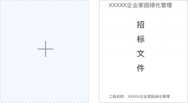
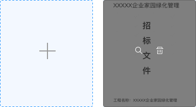
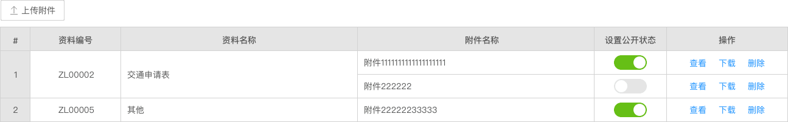

## Upload 上传

通过点击或者拖拽上传文件，给用户提供两种选择。

**应用场景**：用于需要用户上传资料时使用。  
**交互方式**：1.可点击按钮打开文件选择窗口。2.可直接拖拽文件到特定区域内。

### 类型一

应用场景：多用于可以上传图片并显示缩略图。当上传图片数到达限制后，上传按钮消失。  
交互方式：点击上传按钮触发系统文件选择窗口，鼠标悬浮在已上传的图片上，可以查看和删除文件。

<el-row :gutter="20">
 <el-col :span="12">
  默认状态
    
  </el-col>
  <el-col :span="12">
  悬浮状态
    
  </el-col>
</el-row>

### 类型二

应用场景：用于拖拽文件到指定区域的场景，也支持点击上传文件。  
交互方式：把文件拖入指定区域，完成上传，同样支持点击上传。

### 类型三

应用场景1：用于表格内上传文件，且每条只能上传一个文件。  
交互方式：点击操作列的上传按钮，在弹出的系统文件选择窗内选择文件后完成上传，只能上传一个文件。

应用场景2：用于表格内上传文件，每条可上传多个附件。  
交互方式：点击表格上方的上传附件按钮，在弹出的系统文件选择窗内选择文件后完成上传，可多次上传。

