

## 设计原则

    <ul>
        <li v-for="(item, key) in prefaceList" :key="key">
            
            
{{item.title}}

        </li>
    </ul>

### 亲密性

如果信息之间关联性越高，它们之间的距离就应该越接近，也越像一个视觉单元；反之，则它们的距离就应该越远，也越像多个视觉单元。亲密性的根本目的是实现组织性，让用户对页面结构和信息层次一目了然。

#### 间隔
把相似或相关的元素组织在一起，对不相关或不相似的元素进行分离，分为横向间隔和纵向间隔。   
#### 空白区域
Web页面中空白区域，利用“外边距”（margin）来分隔每个元素，内边距用来平衡内容与空白区域。   
#### 亲密性与排版
过往的产品中，一般沿用10px的基础间距，可以通过加减“基础间距”的倍数，或增加元素来拉开信息层次。例：间距=10+10*n。其中，n>=0，10为【基础间距】。  

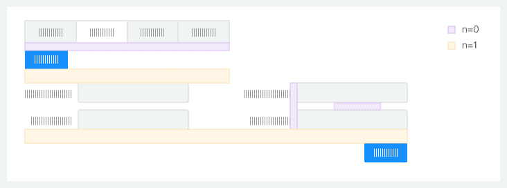

### 对齐

正如『格式塔学派』中的连续律（Law of Continuity）所描述的，在知觉过程中人们往往倾向于使知觉对象的直线继续成为直线，使曲线继续成为曲线。在界面设计中，将元素进行对齐，既符合用户的认知特性，也能引导视觉流向，让用户更流畅地接收信息。

#### 1. 文案类对齐
如果页面的字段或段落较短、较散时，需要确定一个统一的视觉起点。  
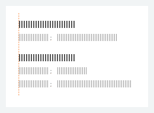

#### 2. 表单类对齐
如果页面的字段或段落较短、较散时，需要确定一个统一的视觉起点。  
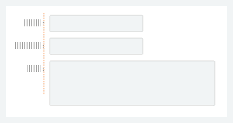

#### 3. 数字类对齐
为了快速对比数值大小，建议所有数值取相同有效位数，并且右对齐。（金额需按照规范显示）  
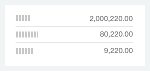

### 对比
对比是增加视觉效果最有效方法之一，同时也能在不同元素之间建立一种有组织的层次结构，让用户快速识别关键信息。

#### 主次关系对比
为了让用户能在操作上（类似表单、弹出框等场景）快速做出判断， 来突出其中一项相对更重要或者更高频的操作。  

在一些需要用户慎重决策的场景中，系统应该保持中立，不能替用户或者诱导用户做出判断。  
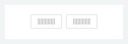

#### 总分关系对比
为了让用户能在操作上（类似表单、弹出框等场景）快速做出判断， 来突出其中一项相对更重要或者更高频的操作。  
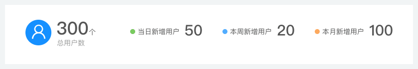

#### 状态关系对比
通过改变颜色、增加辅助形状等方法来实现状态关系的对比，以便用户更好的区分信息。常见类型有：静态对比、动态对比。  
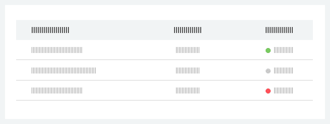

### 重复
相同的元素在整个界面中不断重复，不仅可以有效降低用户的学习成本，也可以帮助用户识别出这些元素之间的关联性。   
重复元素可以是一条粗线、一种线框，某种相同的颜色、设计要素、设计风格，某种格式、空间关系等。  
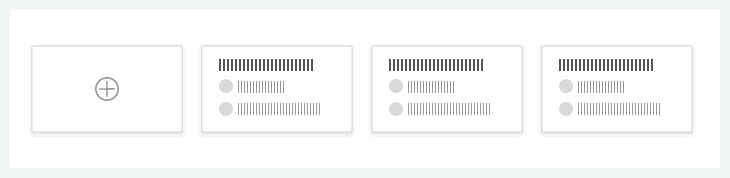  
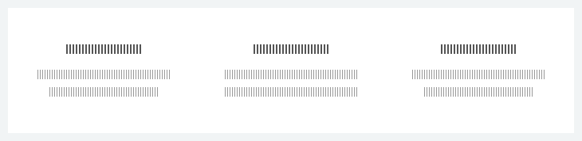

### 直截了当
正如 Alan Cooper 所言：『需要在哪里输出，就要允许在哪里输入』。这就是直接操作的原理。eg：不要为了编辑内容而打开另一个页面，应该直接在上下文中实现编辑。

#### 页内编辑
单文本编辑：当【易读性】为主，同时又要突出操作行的【易编辑性】时，可使用【文字链/图标编辑】。  
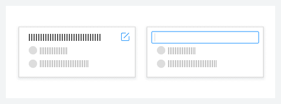

表格内编辑：编辑数据表格在大众化的web应用程序中并不常见，但在企业级web应用程序中，表格则占据统治地位。最常见的用户需求，就是想要像Excel一样实现表格编辑。 显示数据表格时首要考虑的因素还是外观表现，编辑功能次之。因此编辑功能一开始是隐藏的，只有用户明确表现出希望编辑某个单元格时，编辑功能才会启动。  
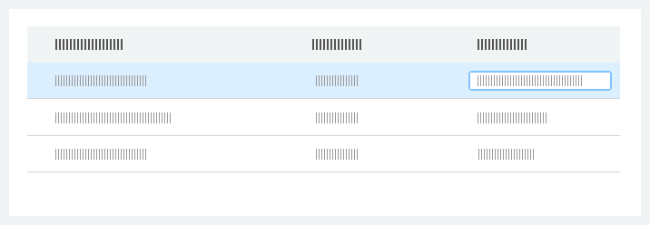

#### 利用拖放
拖放列表：只能限制在一个维度（上/下或者左/右）进行拖放。 
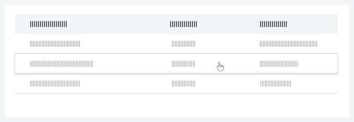

拖放图片/文件：在WEB界面中使用拖放操作必须有所节制，因为该项功能不容易发现，有时甚至达不到期望的效果。这里将拖放操作作为一种快捷机制，快速拖放上传图片/文件直接上传。
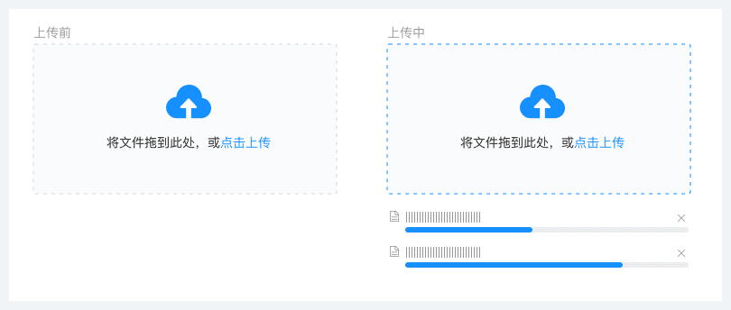

切换选择：切换选择是实现不连续选择的最简单方式。选择某一项后，可以对该项执行相应操作。这些操作一般要通过单击另一个按钮来执行。例如：穿梭框。  
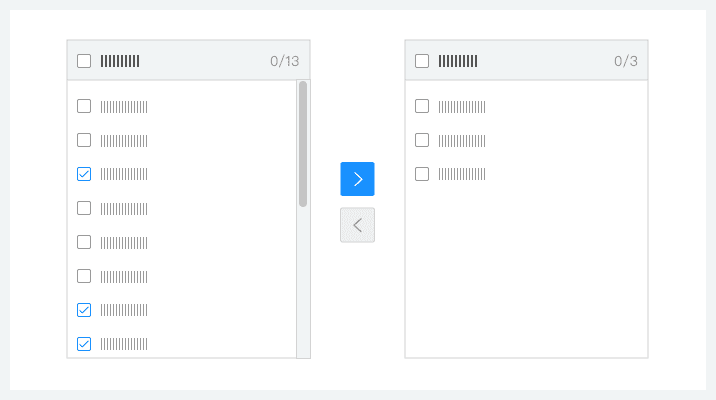

### 足不出户
能在这个页面解决的问题，就不要去其它页面解决，因为任何页面刷新和跳转都会引起变化盲视（Change Blindness），导致用户心流（Flow）被打断。频繁的页面刷新和跳转，就像在看戏时，演员说完一行台词就安排一次谢幕一样。

#### 覆盖层
覆盖层实际上就是一个轻量级的弹出窗口。轻量级是覆盖层与传统浏览器弹出窗口的重要区别。 二次确认覆盖层：避免滥用 Modal 进行二次确认，应该勇敢的让用户去尝试，给用户机会『撤销』即可。  
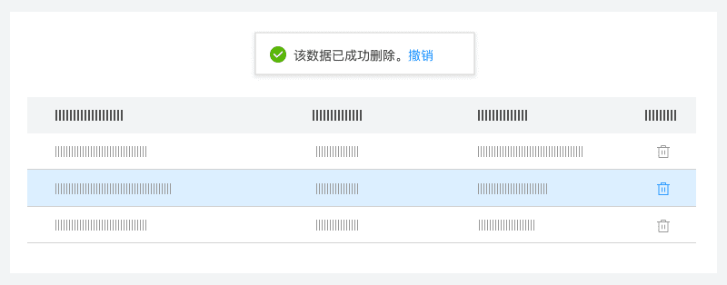  
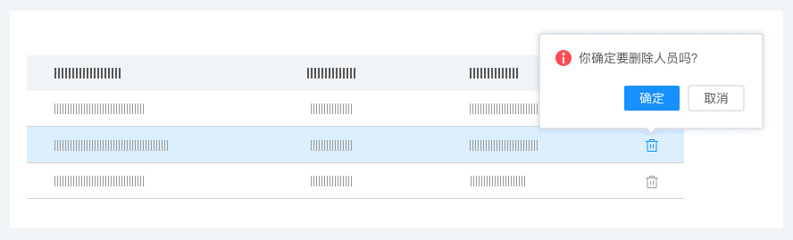  

#### 详情覆盖层
一般在列表中，通过用户『悬停』/『点击』某个区块，在当前页加载该条列表项的更多详情信息。  
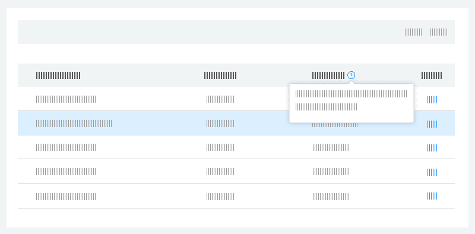  

#### 嵌入层
标签页：将多个平级的信息进行整理和分类了，一次只显示一组信息。  
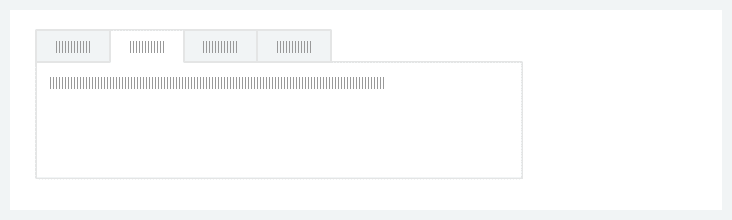  

列表嵌入层：在列表中，显示某条列表项的详情信息，保持上下文不中断。  
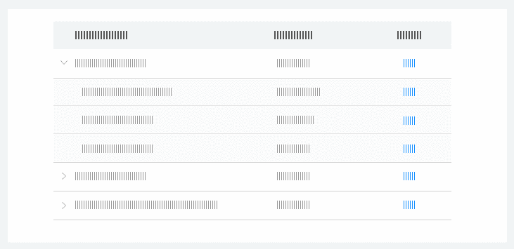  

### 简化交互
根据费茨法则（Fitts's Law）所描述的，如果用户鼠标移动距离越少、对象相对目标越大，那么用户越容易操作。通过运用上下文工具（即：放在内容中的操作工具），使内容和操作融合，从而简化交互。

#### 实时可见工具
如果某个操作非常重要，就应该把它放在界面中，并实时可见。  
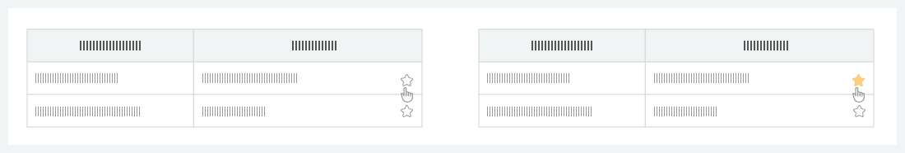

#### 悬停即现工具
如果某个操作不那么重要，或者使用『实时可见工具』过于啰嗦会影响用户阅读时，可以在悬停在该对象上时展示操作项。  
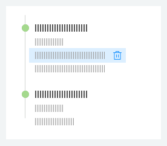

### 提供邀请
web富交互设计面临的一个主要挑战就是易发现性。再好的功能如果用户发现不了，结果仍然等于零。提供邀请是改善易发现性的重要途径。邀请可以提示用户下一步的交互操作是什么。 

#### 静态邀请
指通过可视化技术在页面上提供引导交互的邀请。

引导操作：一般以静态说明形式出现在页面上，不过它们在视觉上也可以表现出多种不同样式。 常见类型：【白板式邀请】、【未完成邀请】。  

漫游探索：漫游探索是向用户介绍新功能的好方法，尤其是对于那些设计优良的界面。但是不能通过此方法解决界面交互的真正问题，不会让难用的站点变得好用。  
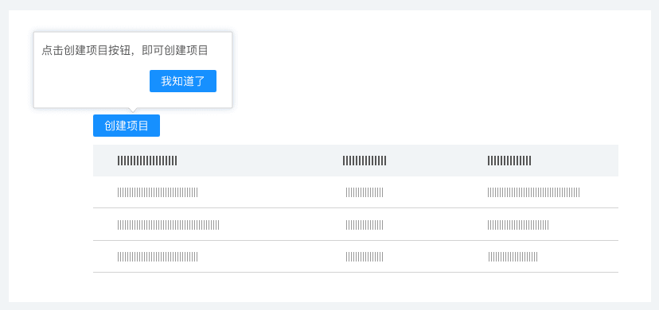

#### 动态邀请
指以响应用户在特定位置执行特定操作的方式，提供特定的邀请。

悬停邀请：在鼠标悬停期间提供邀请。  
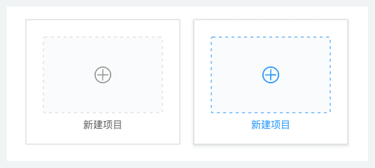

### 即时反应
『即时反应』的重要性体现在交互之后立即给出反馈。 

#### 查询模式
自动完成：用户输入时，下拉列表会随着输入的关键词显示匹配项。根据查询结果分类的多少，可以分为『确定类目』、『不确定类目』两种类型。  
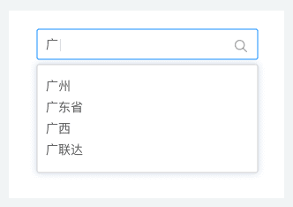

#### 反馈模式
实时预览：在用户提交输入之前，让他先行了解系统将如何处理他的输入。  
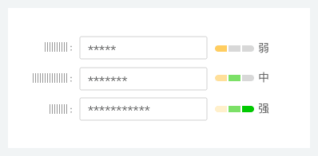

### 一致性
对用户来说，一致性可以降低学习成本。对开发团队来说，可以减少错误，降低产品的维护成本，提高代码和设计的复用率。对企业来说，一致性意味着产品的不同模块要有相似的外观、感觉和行为，这种特性会被扩展到企业其他产品中，有利于强化用户对品牌的认知，建立品牌忠诚度。

#### 交互行为一致性
交互行为一致性又包括操作方式，控件，控件位置等。  
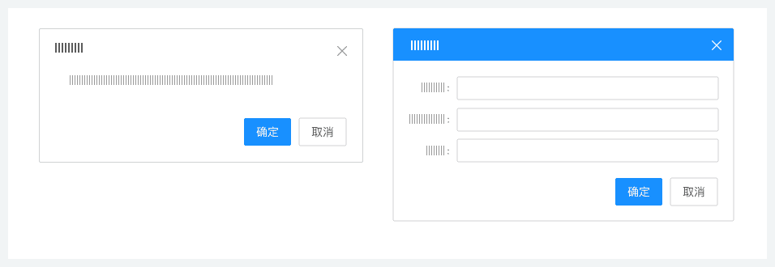

#### 视觉表现一致性
视觉表现一致性，包括风格，色彩，文字，图标，图片等。  
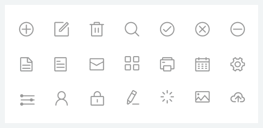

#### 语言表述一致性
同一功能，语言表述应一致，防止用户迷惑。  
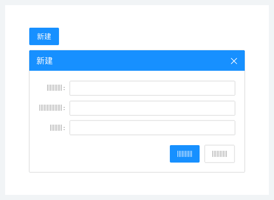

### 容错性
容错性研究是专门针对用户在使用产品的过程中，如何避免出错，以及一旦出错如何尽快纠错的研究。

#### 操作前可预知
有预防用户出错的措施，关键操作有确认提示，及早消除误操作。  
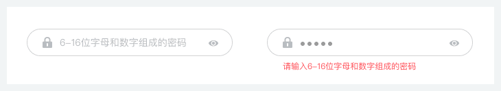

#### 操作后可撤销
允许用户撤销错误操作。  
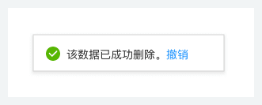